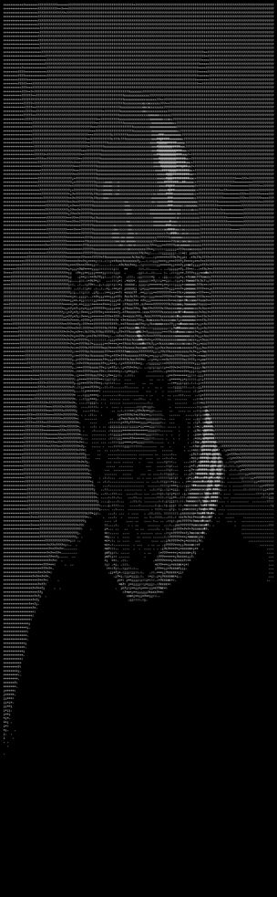

# Image to ASCII CLI

Convert images to ASCII art directly from your terminal.

## Installation

1. Make sure you have [Rust](https://www.rust-lang.org/tools/install) installed.
2. Clone this repository:
	```sh
	git clone <repo-url>
	cd image_to_ascii
	```

## Usage

```sh
cargo run -- <input_image>
```

- `<input_image>`: Path to the image file you want to convert. (Relative to [Cargo.toml](/Cargo.toml))

### Example




## License
[MIT](/LICENSE)
